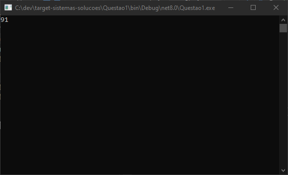
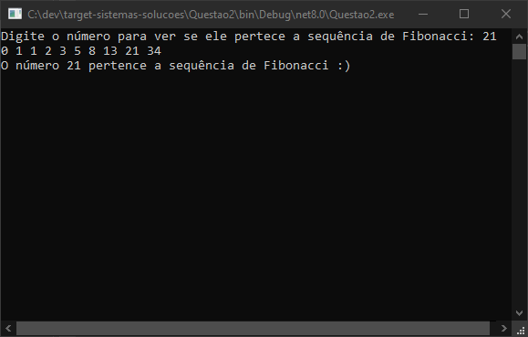
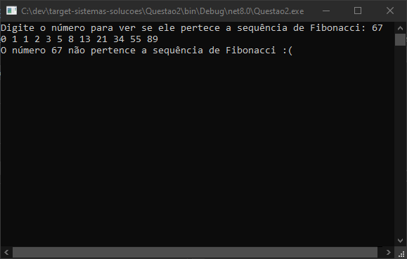
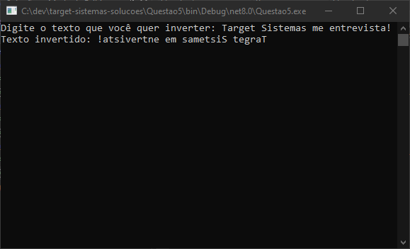

<h2 align="center" id ="sobre">Teste Target 🎯</h2>

<h4 align="center"> 
	Desafio Target de lógica de programação e algoritmo. 🧵
</h4>

 <a href="#sobre">Sobre</a> • 
 <a href="#demonstracao">Demonstração</a> • 
 <a href="#tecnologias">Tecnologias</a> • 
 <a href="#autor">Autor</a>

<h2 align="center" id="sobre">Sobre</h2>

  Proposta de desafio feita pela Target Sistemas para um estágio na área de desenvolvimento.
  Foram 3 questões para ver se a lógica estava em dia.

  Foi um total de 5 questões, onde 3 envolveram códigos e as outras duas um teste de lógica por inferência, solução de problemas e análise.

  Muito interessante passar por processos assim! Eu curti muito!!

<h2 align="center" id="obs-importante">Observação importante</h2>

  Eu acabei colocando as minhas respostas e resoluções dos exercícios de lógica dentro da caixa de texto da própria gupy e não aqui! Espero que não atrapalhe!!
  Por aqui eu acabei colocando apenas os códigos que foram pedidos. 

<h2 align="center" id="demonstracao"> Demonstração </h2>

 	</img>
	
Saída da primeira questão, que o objetivo foi demonstrar qual seria a saída de um código previamente estabelecido. 

	<h2></h2>
	</img>
	
Resultado da segunda questão, que o objetivo foi fazer um código que responderia se um número qualquer pertenceria a sequência de Fibonacci ou não. Nesse caso, ele pertence.

	</img>
	
Resultado da segunda questão. Nesse caso, o número não pertence a sequência.

	<h2></h2>
	</img>
	
Resultado da quinta questão, que o proposto foi fazer um código que invertesse uma string.

<h2 align="center" id="tecnologias">
  Tecnologias
 </h2>
 

      	 <a href="https://learn.microsoft.com/pt-br/dotnet/csharp/"> C# </a> •
	 <a href="https://learn.microsoft.com/en-us/visualstudio/windows/?view=vs-2022"> VSCommunity 2022</a> 

## Autor
Feito com carinho e dedicação!

